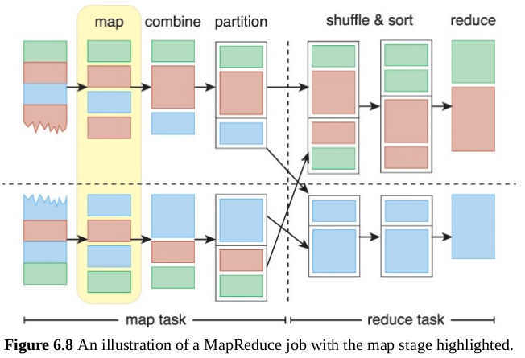
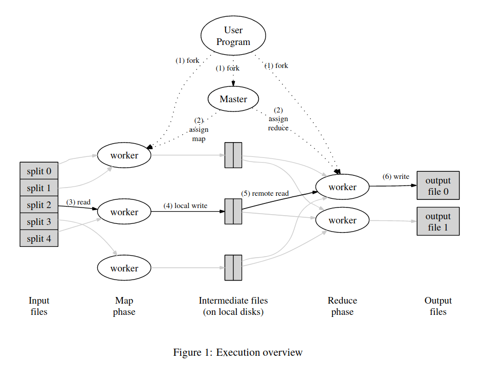

# 单机 MapReduce 单词统计

## 什么是 MapReduce?

MapRuduce 是一个编程模型，它出自 Google 在2004年发布的这篇[论文](https://pdos.csail.mit.edu/6.824/papers/mapreduce.pdf)。这个算法被广泛运用在大数据处理中。在大数据领域，数据的处理有两个方式：**批处理(Batch Mode)**和**实时处理(Realtime Mode)**。MapReduce 是属于批处理模式的。

批处理模式就是等待数据堆积到一定程度，然后一口气集中精力把所有的工作全做完。MapReduce 帮助人们把大规模的数据拆许多小块，运用“分而治之”的思想，把一个大问题分解成可被解决的小问题集合。

## MapReduce 工作原理

MapReduce 分为 *Map Tasks* 和 *Reduce Tasks*，其中每个 Task 还包含了不同阶段，它们分别有：

- Map Tasks
  - <u>map</u> stage
  - <u>combine</u> stage(optional)
  - <u>partition</u> stage
- Reduce Tasks
  - <u>shuffle and sort</u> stage
  - <u>reduce</u> stage

它们的逻辑如下图所示：



MapReduce 逻辑也可以由下列数学表达式概括：
$$
map(k_1,v_1) \ \rightarrow \ list(k_2,v_2) \\
reduce(k_2,list(v_2)) \ \rightarrow \ list(v_2)
$$
如果写成伪代码，则是：

```python
def map(String key, String value):
    # key: document name
    # value: document contents
    for each word w in value:
        EmitIntermediate(w, "1");
        
def reduce(String key, Iterator values):
    # key: a word
    # values: a list of counts
    int result = 0;
    for each v in values:
        result += ParseInt(v);
    Emit(AsString(result));
```


# 示例程序

实现一个分布式 MapReduce 算法是比较复杂的，这里我们只演示用 Golang 实现的一个单机 MapReduce 算法。下图是执行程序的示意图：



我们的单机 MapReduce 单词统计实例程序，可以将输入的文本数据拆成4份，并用 Goroutine 创建4个 MapWorker，分别对文本数据进行单词个数的统计，并将生成的中间结果（Key-Value pair）通过信道传递到 Master Routine 上进行调度。

这里的 Master Routine 实际上就是将4个 MapWorker 生产的临时 Key-Value pair 数据分配到两个 ReduceWorker 上继续汇总，最后将 ReduceWorker 生产的结果再传递到 SumReduce 上进行最终汇总。


# 参考资料

- [Go并发编程实战第九章](http://product.dangdang.com/29120162.html)
- [大数据导论第六章](http://product.dangdang.com/25088374.html)


---